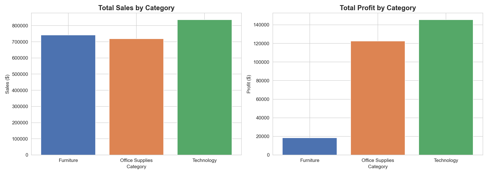
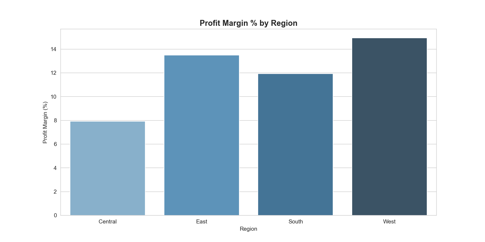
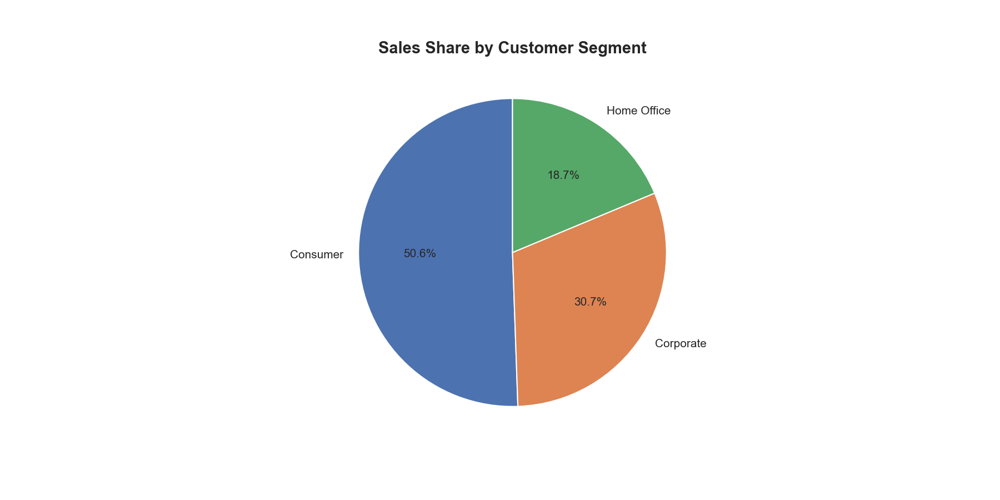
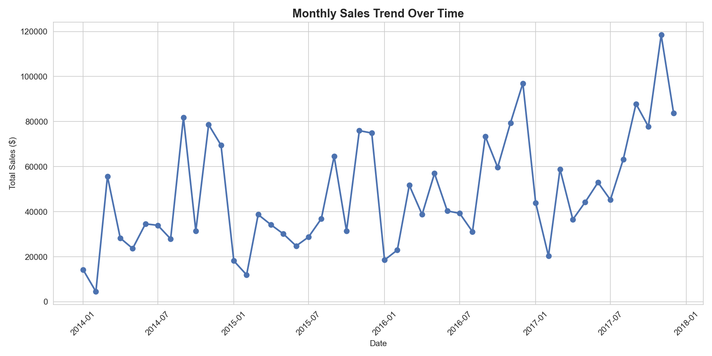
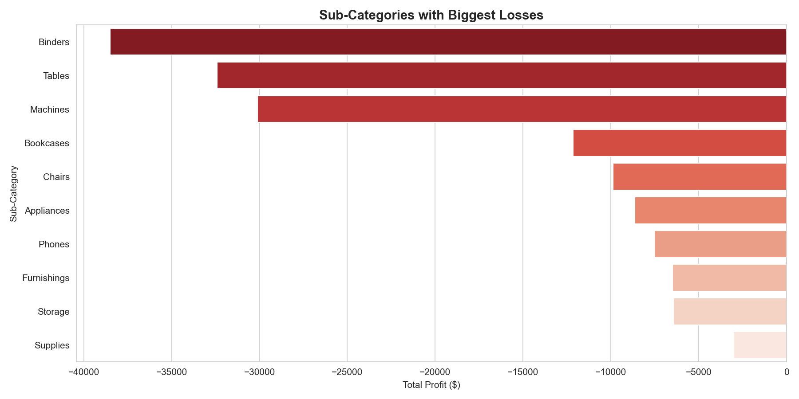

# Superstore Sales Analysis
## Exploratory Data Analysis | Portfolio Project 1

**Author:** SUFIA HAQUE
**Tools:** Python, Pandas, Matplotlib, Seaborn  
**Dataset:** Sample Superstore (Kaggle)

##  Business Questions Answered
1. Which category drives the most sales and profit?
2. Which region performs best?
3. Which customer segment is most valuable?
4. How have sales trended over time?
5. Which products are losing money?

## Key Charts

##  Key Recommendations
1. Discontinue or reprice Tables — biggest loss-maker
2. Invest more in the West region
3. Run Q4 campaigns targeting Consumer segment
4. Bundle Office Supplies with Technology products
5. Review heavy discount strategy
